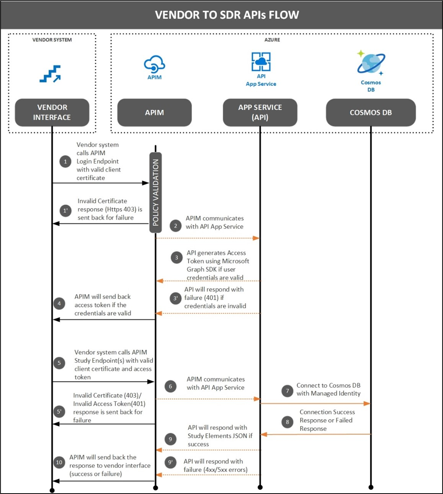

- [Introduction & Purpose](#introduction--purpose)
- [Definitions and Acronyms](#definitions-and-acronyms)
- [List of API endpoints](#list-of-api-endpoints)
- [New Endpoints](#new-endpoints)
- [Migrated Endpoints](#migrated-endpoints)
- [Pre-requisites before migration](#pre-requisites-before-migration)
- [Access to SDR environment](#access-to-sdr-environment)
- [Service Account / System Account](#service-account--system-account)
- [User Account](#user-account)
- [Client Certificate](#client-certificate)
- [Group Association](#group-association)
- [API User Guide](#api-user-guide)
- [Migration Steps](#migration-steps)

# Introduction & Purpose
This document details the steps to be performed by existing users/vendors to migrate to new version (Product Release 0.5) of SDR Reference Implementation APIs.

To communicate with new version of SDR APIs, it is mandatory to pass a valid user specific access token along with client certificate. A new token endpoint has been created to allow users to generate access token. Refer below diagram that explains the updated authentication flow of SDR APIs.

<p align="center"> 
  
## Definitions and Acronyms
 |Term / Abbreviation	|Definition|
  |-----|-----|
|SDR	|Study Definitions Repository|
|API|	Application Programming Interface|
|POC|	Point of Contact|
  
 # List of API endpoints
  The old study definitions submitted using the previous versions of APIs were not migrated to new version of API database. Users need to use existing endpoint URLs to get the old study definition data, but with an access token in the request. Please refer [API User Guide](https://github.com/transcelerate/ddf-sdr-api/blob/main/documents/ddf-sdr-user-guide-api-3.0.pdf) on how to generate the access token using the new token endpoint.

Also, the POST study endpoint in previous version of API is disabled and users will not be able to submit any new definitions with old USDM format.
 ## New Endpoints
  
  |Endpoint| 	Method	|URL|	Description|
  |-----|-----|-----|-----|
|Token	|POST	|/api/v1/auth/token	|To generate user access token by passing individual user account/service account credentials.|
  
## Migrated Endpoints
  |Endpoint |	Method	|Existing URL|	New URL|
  |-----|-----|-----|-----|
|Study History|	GET	|/studydefinitionrepository/v1/studyhistory|	/api /v1/ studydefinitions/history|
|Get Study|	GET	|/studydefinitionrepository/v1/study/{studyid}|	/api/v1/studydefinitions/{studyId}|
|Get Study Design	|GET|	/studydefinitionrepository/v1/{studyid}/studydesign/{studyDesignId}|	/api/v1/studydesigns|
|Audit Trail|	GET|	/studydefinitionrepository/v1/auditTrail/{studyId}|	/api/v1/audittrail/{studyId}|
|Post Study	|POST|	/studydefinitionrepository/v1/study|	/api/v1/studydefinitions|
  
  ```
Note: The existing URLs will be decommissioned once all users have migrated to new version of SDR APIs.
  ```
# Pre-requisites before migration
  To access new version of APIs, a user account (or) service account with SDR application access is needed along with a valid client certificate configured on the hosted platform.
 ## Access to SDR environment
  ### Service Account / System Account
•	Existing SDR users having automated processes/interfaces developed to communicate with SDR APIs, need to create a Service account (with valid email address) and share with SDR support team.<br>
•	Email invite will be sent to service account email address for SDR application access.<br>
•	Vendor POC who is managing this service account, should accept the invite and complete the account set-up.
  
### User Account
•	Users with no automated processes/interfaces can continue to use their own credentials to generate a token and communicate with SDR APIs using any REST client tools.<br>
•	Users who have not accepted the invites that were earlier triggered by SDR support team, will have to complete the user set-up process if they wish to access the SDR APIs using their own accounts. They can request SDR support team to trigger the email invite again, if they fail to find one in their inbox (or) if the old invite is expired.
  
 ### Client Certificate
•	Users who had already generated the client certificate and got it configured in SDR system can continue to use the same certificate when accessing the new version of SDR APIs.
  
  ### Group Association
  •	Refer [UI User guide](https://github.com/transcelerate/ddf-sdr-ui/blob/ddf-sdr-ui-user-guide-v3.0.md/documents/ddf-sdr-ui-user-guide-v3.0.md) for Group and User set-up for data access.
  
  ### API User Guide
  •	Refer latest version of [API User Guide](https://github.com/transcelerate/ddf-sdr-api/blob/api-user-guide-markdownfile/documents/ddf-sdr-user-guide-api-v3.0.md) to get complete details about the new version of API Endpoints.
  
 # Migration Steps
•	Create a new activity/task to invoke token endpoint with valid service account/user account credentials and client certificate.<br> 
•	Store the access token generated by token endpoint, which will be valid for 120mins from the time of generation.<br> 
•	Modify the URLs of all other endpoints to match with latest version of endpoints.<br> 
•	Modify all API requests to pass the access token as header parameter in the request.<br>
      o	“Authorization” : “Bearer xxxxxx”<br> 
•	Vendor specific Client certificate also should be passed when calling SDR API endpoints along with access token.<br> 
•	Modify data mapping for all endpoints by referring to the [API User Guide](https://github.com/transcelerate/ddf-sdr-api/blob/api-user-guide-markdownfile/documents/ddf-sdr-user-guide-api-v3.0.md).<br> 
•	Add a fallback/retry step for all API activities/tasks to generate a new token if the existing token is expired.
